<p align="center">
  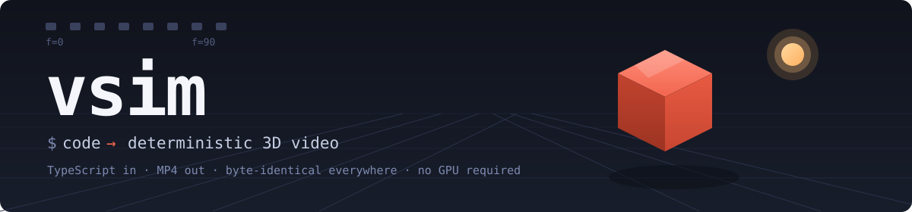
</p>

**"Remotion for real 3D."** Write a 3D scene in TypeScript — meshes, characters, physics,
audio — run one command, and get a **deterministic** MP4. The same scene plays live in the
browser, byte-for-byte identical to the export.

```bash
npm i -D @vsim/cli @vsim/authoring
npx vsim render scene.ts -o out.mp4          # add --workers 4 for multi-core
```

<table>
<tr>
<td>

```ts
// scene.ts
import { scene } from "@vsim/authoring";

export default scene({ fps: 30, duration: 90, width: 640, height: 360 })
  .material("cube", { color: [0.95, 0.4, 0.4], roughness: 0.5 })
  .light({ type: "ambient", intensity: 0.35 })
  .light({ type: "directional", intensity: 1.2, direction: [-0.5, -1, -0.35] })
  .mesh("floor", { geometry: { kind: "plane", size: [20, 20] },
                   material: "cube", position: [0, -1, 0] })
  .mesh("cube", { geometry: { kind: "box", size: [1.4, 1.4, 1.4] },
                  material: "cube" })
  .camera({ position: [3, 2.2, 4.5], lookAt: [0, 0.3, 0], fov: 45 })
  .animate("cube", "rotation.y", [
    { frame: 0, value: 0 },
    { frame: 90, value: Math.PI * 2 },
  ])
  .build();
```

</td>
<td width="40%" align="center">
  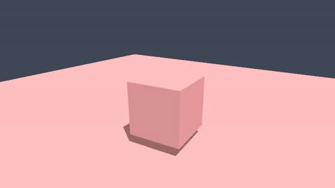<br/>
  <sub>← this file, rendered. Nothing else involved.</sub>
</td>
</tr>
</table>

That's the whole loop: a `.ts` file in, a reproducible `.mp4` out — no GPU, no native
renderer, no cloud account. The default engine is a pure-TypeScript rasterizer with
per-pixel PBR lighting, shadow maps, and supersampling, so it runs identically on your
laptop, in CI, and in the browser.

## Show me

Everything below is rendered by vsim itself — clone the repo and `pnpm showreel` rebuilds
all of it from source.

<p align="center">
  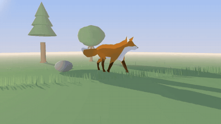
  <br/>
  <sub><code>examples/06-fox</code> — golden-hour sun + glow, sky-derived ambient, fog, 700 blades of grass. Pure TypeScript, no GPU.</sub>
</p>

<p align="center">
  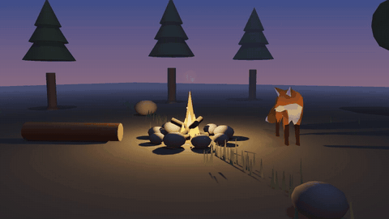
  <br/>
  <sub><code>examples/24-campfire</code> — one flickering point light with inverse-square falloff (<code>decay: 2</code>) IS the scene: breathing cube shadows, spark & smoke particles, ACES rolling the flames off filmically.</sub>
</p>

And this one wasn't written by a person at all:

<p align="center">
  
  <br/>
  <sub><strong>The AI wrote this entire film from one prompt</strong> — <code>vsim film -p "how a CDN makes websites fast"</code>. Claude authors a schema-validated screenplay (<a href="packages/motion/films/cdn/filmdoc.json"><code>filmdoc.json</code></a>, committed right here); vsim renders it deterministically. The screenplay re-renders byte-identically forever — no AI needed after the first take. See <a href="#the-ai-authors-vsim-renders">how</a>.</sub>
</p>

| | | |
|:---:|:---:|:---:|
| 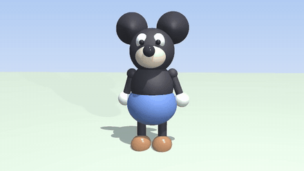 | 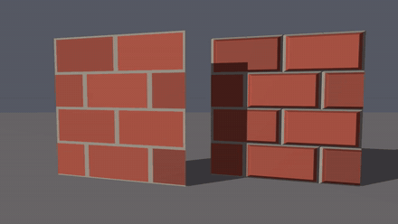 | 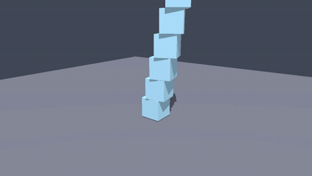 |
| **Character from primitives** — no rig, just pivoted node groups ([`21-mouse`](examples/21-mouse)) | **Normal mapping** — both walls are the same flat quad; the right one carries a tangent-space map ([`22-normalmap`](examples/22-normalmap)) | **Deterministic physics** — Rapier rigid bodies, the same collapse every run ([`02-physics`](examples/02-physics)) |
| 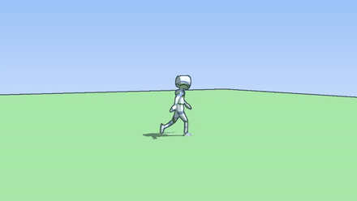 | 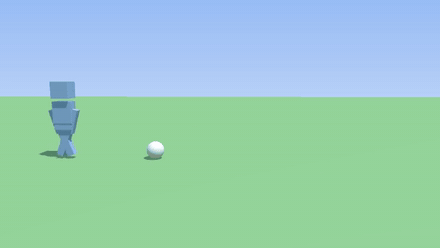 | 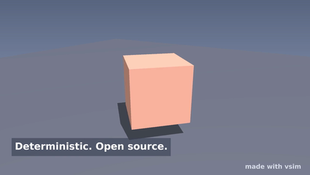 |
| **Manga mode** — cel-shading + ink outlines with one flag: `style: "manga"` ([`09-manga`](examples/09-manga)) | **Keyframe animation** — a hand-animated kick and a launched ball ([`08-soccer`](examples/08-soccer)) | **Text & titles** — true vector type composited over the 3D ([`20-titles`](examples/20-titles)) |

There are **25 examples** in [`examples/`](./examples) — rigged glTF characters,
MakeHuman humans with real skin textures, a VRM avatar, beat-synced audio, morph-target
lip-sync, procedural parks, a trotting quadruped, and more:

```bash
pnpm install
pnpm example:fox      # → out/fox.mp4 (any example works: cube, physics, crossfade, …)
pnpm showreel         # renders all 24 reel scenes in parallel → out/showreel.mp4
```

## Why vsim?

- **Preview == render == every variant.** Time is frame-based (never wall-clock), all
  randomness flows through a seeded RNG (`Math.random` is lint-banned in runtime code),
  and CI enforces byte-identical renders with golden-frame hashes. Render one video or
  fan out 100 personalized variants — every pixel is reproducible.
- **Runs anywhere.** The reference renderer is pure TypeScript: no GPU, no node-gyp, no
  headless-Chrome. CI boxes, serverless, browsers — same bytes everywhere. A Three.js
  engine (GPU) is a drop-in swap for high-fidelity preview.
- **Web-first.** The player, the rig loader, and even MP4 export (WebCodecs) run in the
  browser on the exact same runtime as the headless renderer.
- **Scriptable like code, editable like a doc.** Every scene is a plain, zod-validated
  JSON document — authored fluently from TypeScript, diffable in git, and safely
  editable by the AI copilot.

## What's in the box

- **Code → video**: declarative scene builder → MP4 via `vsim render` (`--workers N`
  splits frames across cores, byte-identical to single-threaded).
- **Realistic software rendering**: per-pixel PBR (roughness/metalness + full texture-map
  set with normal mapping), 2× supersampling in linear light, PCF-filtered directional
  shadows and point-light cube shadows, mip-mapped trilinear texture sampling,
  perspective-correct interpolation, sorted transparency, optional ACES tone mapping.
- **Atmosphere**: gradient sky with a visible sun disc + glow, sky-derived hemisphere
  ambient, linear distance fog, and closed-form deterministic particles.
- **Animation**: keyframe tracks, glTF skeletal clips with layered crossfades
  (`idle → walk → run`), ground-contact IK with **stance locking** (in-place walk cycles
  drive real locomotion), spring bones for secondary motion, and morph-target lip-sync.
- **Physics**: deterministic Rapier rigid bodies, fixed-step, reproducible.
- **Assets**: glTF/GLB load + export — including browser-safe rig parsing (`loadRigFromUrl`),
  plus a bundled [character library](./packages/assets/library/CREDITS.md) — KayKit heroes,
  generated animals, MakeHuman humans — loaded by name with `loadCharacter()`.
- **Audio**: mux a track into the MP4 and drive properties from beat frames.
- **Live preview**: a browser player that shares the exact runtime with the renderer,
  plus in-browser MP4 export via WebCodecs (`renderToSink`).
- **Photoreal finals**: hand the same scene document to Blender Cycles for a path-traced
  master (`apps/studio/cycles-render.mjs`; works with just `pip install bpy`) — see the
  [Blender guide](./docs/guides/blender-characters.md).

## The AI authors, vsim renders

Every AI feature follows one rule: the model writes a **validated document** at authoring
time, and the deterministic pipeline renders it. The AI can propose a bad scene or film —
it cannot emit an invalid one, and it never touches the render loop. It runs through the
Anthropic SDK (`ANTHROPIC_API_KEY`) **or**, if no key is set, the `claude` CLI (a Claude
Code login) — whichever you have.

**Edit scenes in natural language** — prompts become schema-constrained edit operations,
grounded in the scene's existing objects:

```bash
vsim edit scene.ts --prompt "make the cube blue and add a point light" -o edited.scene.json
vsim edit scene.ts --prompt "spin it twice as fast" --render out.mp4
```

```ts
import { editScene, CopilotSession } from "@vsim/ai";
const { doc, operations, summary } = await editScene({ doc: scene, prompt: "add a red floor" });

// Multi-turn refine — follow-ups resolve against the running transcript:
const session = new CopilotSession(scene);
await session.refine("make the cube blue");
await session.refine("now spin it twice as fast"); // "it" = the cube
session.document; // the edited scene so far
```

**Write whole 2D explainer films from a topic** — `vsim film -p "<topic>"` asks Claude for
a **FilmDoc**: the screenplay as a zod-validated document (stage entities, beats, actions,
camera), interpreted by the [motion/](#motion--films-from-svg--css) studio. The committed
`filmdoc.json` re-renders byte-identically forever, no AI required. The CDN film
[featured above](#show-me) was made exactly this way, as was
[`films/load-balancer`](packages/motion/films/load-balancer) — both screenplays landed
valid on Claude's first attempt.

```bash
pnpm film:gen "how a CDN makes websites fast"   # → screenplay + out/<slug>.mp4
```

**Direct 3D films from a story** — `vsim film -p "<story>" --template 3d` asks for a
**Film3DDoc** instead: a set preset, dressed props (trees, rocks, bushes, flowers, ponds,
fallen logs, lanterns, a lit campfire), a cast, beats of `move`/`play`/`face` actions with
a spoken `narration` line, and a shot list (wide/close/follow/orbit cuts). The
`@vsim/film3d` compiler lowers it to a plain scene document and the engine renders it —
the schema validates everything, so the model can't hand back a film that doesn't run.

<p align="center">
  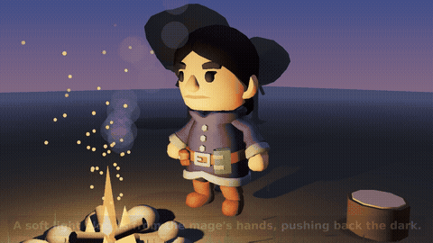
  <br/>
  <sub><strong>"Watchfire"</strong> — written, staged, and shot by the AI from one prompt
  (<a href="films/camp-tale.film3d.json"><code>camp-tale.film3d.json</code></a>), starring the
  CC0 <a href="packages/assets/library/CREDITS.md">KayKit adventurers</a>. Before the final render the
  director <strong>watched its own dailies twice</strong> and revised the cut both times; the
  narration is TTS, muxed in deterministically.</sub>
</p>

| | | |
|:---:|:---:|:---:|
| 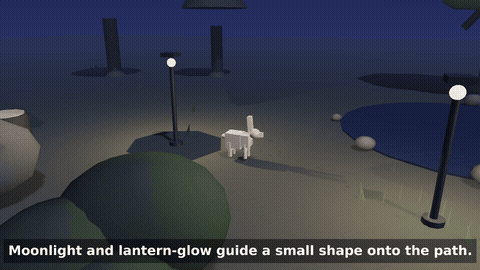 | 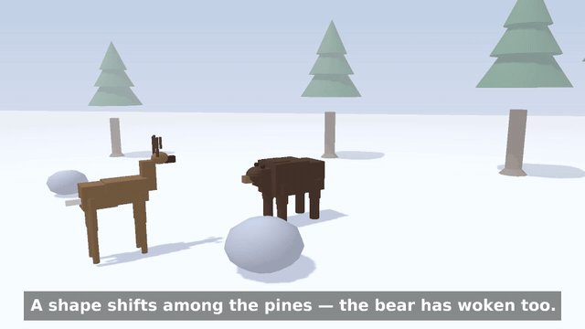 | 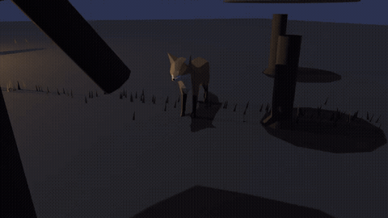 |
| **Night, dressed** — a rabbit follows lantern light past a starlit pond ([`lantern-path`](films/lantern-path.film3d.json)) | **The animal cast** — deer, rabbit, and bear share a snowy dawn ([`snowy-dawn`](films/snowy-dawn.film3d.json)) | **Photoreal master** — the same screenplay, path-traced by Cycles: GI firelight, fog, sky, sparks ([how](docs/plan-film3d.md)) |
| 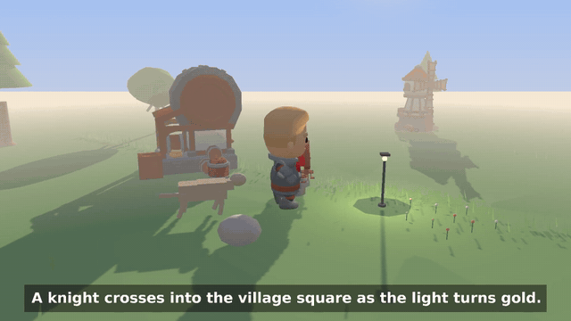 | 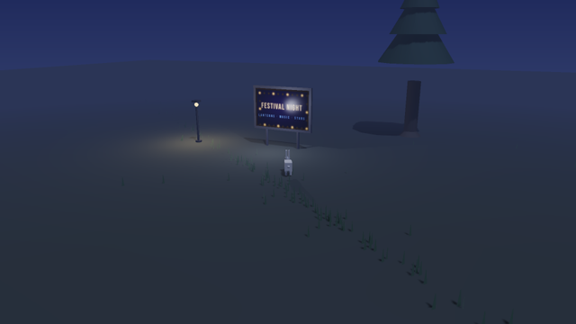 | 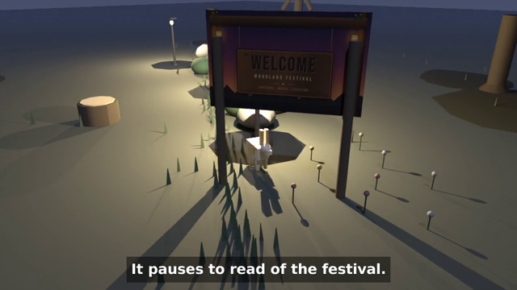 |
| **A whole village from one prompt** — the director staged the tavern, well, windmill, hut, and clutter itself ([`village-dusk`](films/village-dusk.film3d.json)) | **Screens that play** — an HTML marquee baked to a frame sequence, looping in-world on the `screen` prop | **AI artwork, path-traced** — the `vsim surface`-designed welcome board under Cycles lantern light ([`festival-night`](films/festival-night.film3d.json)) |

The pipeline behind those: the cast mixes **professional CC0 packs** (KayKit's knight,
barbarian, mage, rogue — faces, outfits, dozens of clips like `Spellcasting` and `Cheer`),
**generated animals** (fox, dog, deer, bear, rabbit, wolf — spec tables compiled headlessly
by Blender, MIT), and MakeHuman humans with baked PBR skin. Beats carry **narration**
(espeak-ng offline, ElevenLabs via env). The director **reviews its own dailies** — one
rendered still per shot, two rounds by default, later rounds seeing the previous round's
frames — and every revision is re-validated. `vsim render` accepts `*.film3d.json`
directly; the same file renders a **path-traced master** via
`apps/studio/cycles-render.mjs` (sky, sun, fog, and particles all translate). And the cast
is **self-expanding**: `vsim creature -p "a gray wolf, lean and watchful"` designs a new
species as a validated CreatureDoc, compiles it, reviews its own turntable, and registers
it as castable ([`creatures/wolf.creature.json`](creatures/wolf.creature.json) was made
exactly that way). Even the ARTWORK is AI-made: `vsim surface -p "a rustic welcome
board…"` designs a self-contained HTML artifact under a strict determinism lint, bakes it
with a pinned headless Chromium, reviews its own proof, and registers it — films then
stage it as a `sign` prop, or extrude committed SVGs as `cutout` scenery
([the surface pack](docs/plan-surface-pack.md)). Surfaces can even **animate**: an HTML
page implementing the recorder's film contract bakes to a committed frame sequence, and
the `screen` prop plays it in-world on a kiosk — a marquee with chasing bulbs, looping
deterministically via a `texture.frame` track. And the sets got an architecture upgrade:
`building` (hut, tavern, windmill, well, tower) and `clutter` (barrels, crates, tents)
props stage real CC0 KayKit models, bundled as self-contained GLBs — so one prompt can
now raise a whole village.

## vsim Studio — the visual editor

The first slice of the **visual editor** (surface 2). A browser app on top of the same engine:
load a scene, **play/scrub** the timeline, **select** an object, **edit** its transform/colour
live, **keyframe** those properties (value at one frame, another later → it animates, with clickable
markers on the timeline), ask the **AI copilot** to change the scene in natural language, and
**render an MP4** — all in the browser. The preview updates instantly because the runtime reads the
scene document every frame, so *preview == render*.

```bash
pnpm studio:server   # backend (AI copilot + MP4 render) → http://localhost:8787
pnpm studio          # editor (Vite dev server)         → http://localhost:5173
```

Built with Vite + vanilla TS (no UI framework), reusing `@vsim/player` + `@vsim/engine-three` in the
browser and `@vsim/ai` + `@vsim/render` in a tiny Node backend (the AI uses
`ANTHROPIC_API_KEY` or the `claude` CLI).

## Packages

| Package | Role |
|---------|------|
| `@vsim/core` | Scene document schema, fixed-timestep clock, seeded RNG, animation eval, math, engine interface — **zero engine deps** |
| `@vsim/engine-software` | Pure-TS reference rasterizer. Runs anywhere (no GPU), bit-identical — the determinism oracle & default renderer |
| `@vsim/engine-three` | Three.js production renderer (GPU, high fidelity) + experimental path-tracer / WebGPU backends |
| `@vsim/text` | Deterministic vector text rasterizer (bundled font → glyph fill) for screen-space titles/captions |
| `@vsim/physics-rapier` | Deterministic Rapier physics adapter |
| `@vsim/render` | Headless frame capture → ffmpeg → MP4 (+ audio mux, multi-core workers) |
| `@vsim/authoring` | Declarative builder API: code → scene document |
| `@vsim/player` | Browser real-time preview component |
| `@vsim/assets` | glTF/GLB asset pipeline (load + export) + character library |
| `@vsim/ai` | AI copilot: natural-language prompt → schema-constrained scene-document edits (Claude tool-use) |
| `@vsim/cli` | `vsim render scene.ts -o out.mp4` · `vsim film -p "…"` · `vsim edit scene.ts --prompt "…"` |
| `@vsim/motion` | The 2D animation studio: design tokens, frame-pure timeline, explainer kit, deterministic HTML→MP4 recorder |
| `@vsim/film3d` | AI-directed 3D films: Film3DDoc (a validated high-level screenplay — sets, actors, beats, shots) compiled to a scene document |

## motion/ — films from SVG + CSS

A second way to make video, built on the same determinism contract: author a film as an
HTML/SVG page on a **frame-pure seekable timeline** (no wall clock — `seek(f)` is a pure
function of the frame index), and the recorder frame-steps it in headless Chromium into a
byte-reproducible MP4. Design tokens keep every asset on one palette; a 12-primitive
**explainer kit** (servers, packets-along-a-path, draw-on arrows, typing code blocks,
kinetic titles…) covers technical storytelling; the film is driven by an editable
`screenplay.json`.

| | | |
|:---:|:---:|:---:|
| 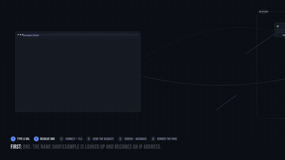 | 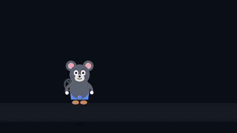 | 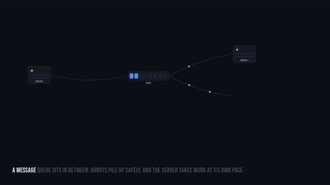 |
| **Technical explainer** — DNS→TLS→request→render with karaoke captions ([`web-request`](packages/motion/films/web-request)) | **Voiced character short** — Pip's mouth is driven by the narration's audio envelope ([`pip-hello`](packages/motion/films/pip-hello)) | **The template proof** — a second explainer from the same kit, one screenplay later ([`message-queue`](packages/motion/films/message-queue)) |

```bash
pnpm film:webreq   # → out/web-request.mp4   — 60s "How a web request works"
pnpm film:queue    # → out/message-queue.mp4 — 42s "What is a message queue?"
pnpm film:pip      # → out/pip-hello.mp4     — Pip the mouse, with TTS narration + lip-sync
pnpm film:kit      # → out/kit-sheet.mp4     — the animated primitive contact sheet
```

Narration is built by `tools/narrate.mjs`: timed lines → TTS → one WAV + a per-frame mouth
envelope the puppet lip-syncs to. The in-repo engine is espeak-ng (offline, deterministic);
an **ElevenLabs** backend is included — set `ELEVENLABS_API_KEY` and switch
`"engine": "elevenlabs"` for a production voice, no film changes.

Prefer the AI to write the screenplay? See
[The AI authors, vsim renders](#the-ai-authors-vsim-renders).

## Docs

- [Quickstart](./docs/quickstart.md)
- [Scene document reference](./docs/scene-document.md)
- [Determinism guide](./docs/determinism.md)
- [ADR 0001 — render backend & determinism](./docs/decisions/0001-render-backend-and-determinism.md)
- [Guide: creating characters with Blender / MakeHuman](./docs/guides/blender-characters.md) — generate rigged, animated, **textured** glTF headlessly (incl. a realistic MakeHuman human with real skin) → `loadGltfRig`

`pnpm docs:site` builds a static documentation site (landing page + the docs above) into
`site/` — generated by the project's own tooling, no framework.

## Develop

Requires Node ≥ 20, pnpm, and ffmpeg on PATH.

```bash
pnpm install
pnpm test          # unit + determinism (golden-frame) tests
pnpm typecheck
pnpm lint          # determinism lint (bans Math.random in runtime)
pnpm build         # compile all packages to dist/
```

Asset source packs (MPFB2, KayKit, MakeHuman assets) are optional, fetched with
`scripts/fetch-asset-packs.sh` — see [`docs/asset-packs.md`](./docs/asset-packs.md).
Releasing is documented in [`RELEASING.md`](./RELEASING.md).

## License

MIT
